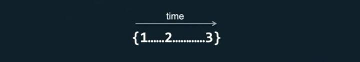
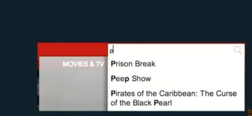

github/zhihu:

# Rxjs [intro]

### The ReactiveX library for Javascript

```
今天我要分享(讲)的是 Rxjs, Rxjs 全称是 The ReactiveX library for Javascript, 大家可以看到有一个单词叫 ReactiveX，ReactiveX 它不是一个标准的英语单词对吧, 因为什么呢, 有 Reactive Java, 有 Reactive Scala， 有 Reactive Javascript, 所以得话呢，我们统称称为 ReactiveX，然后今天不会去深究它的原理， 主要是做一个 introduction level 的一个东西.
```

1. what is reactiveX

2. rxjs core

3. design patterns

4. rxjs in action

```
ok, 我要讲的是这几个大方面, 第一个是 what is reactiveX, 第二个是 rxjs core 也就是 rxjs 的组成部分, 第三个是设计模式 design patterns, 第四个是如何在项目中去使用 rxjs - 第五个是 Q&A question and answer 环节
```
# reactive programming

1. <center>too many version of explanation</center>

```
ok， emm， 第一个 so, what is reactivex, 在网上有非常多的版本的 explanation, 有非常多的版本不同的解释。因为像这种人为定义出来的概念的话，每个人可以有每个人不同的理解对吧，所以网上有非常多不同版本的解释。
```
2. <center>an idea and a breakthrough</center>

```
然后呢, 通俗一点讲我们可以认为他是一种 idea, a breakthrough 是一种突破性编程的一种理念。
```
3. <center>An API for asynchronous programming observable streams</center>

```
然后呢你可以理解它为一种 An API for asynchronous programming observable streams, 虽然说这句话就几个单词但是包含了很多程序基础性的名词，首先 API， 我们每天都在用 API，I 是指 interface, 是指接口，是指使用方和业务方之间的一个接口，我提供给你的接口。 那么 rxjs 呢就可以被看做为一种接口，认为成一种开发接口， 他是为了什么呢， asynchronous programming, 异步编程。然后异步呢
--- 待补充 ---
异步其实可以用英文来解释, 异步是 asynchrous，就是 synchrous 前面加一个 a 对吧，a 的话呢，在英语中一般代表的是反面， 所以我们不具体的说 asynchrous 是什么，而是说同步的反面就是异步，因为异步的话其实范畴还比较广， 很难精确的去解释。然后后面几个单词是 observable streams, observable 是指可被观测的对吧, streams 是指流。 那么就是说 rxjs 做的事情就是提供一个接口来处理异步环境下的一个可被观测的流。
```

# EcoSystem

1. <center>We use ReactiveX
</center>

```
然后我来介绍一下 ecosystem，在网上的话有几个 emm， 几大著名的公司都在使用 rx.js  有 github, microsoft, airbnb, netflix 等等。在某次公开课上, 我也得知了网易部分项目中也使用了 rxjs。包括现在 angular， 大家知道现在 angular2, angular3, angular4 都是采用 rxjs 就是做他的一个，就是整个框架层面的一个 api 嵌入。
```
# Rxjs

<center>The ReactiveX library for Javascript</center>

```javascript
  // emit 1, 2, 3, 4, 5
  const source = Rx.Observable.of(1, 2, 3, 4, 5)
  // take the first emitted value then complete
  const example = source.take(1)
  // output: 1
  const subscribe = example.subscribe(val => console.log(val))
```

```
ok, 那我们来看一下 rxjs 这个东西到底是什么东西，我们应该怎么样去使用他呢我们先看一个简单的一个栗子。 emm，这边说实话，就是大家在看这段代码的时候，因为我不知道你们之前有没有了解或接触过 rxjs，所以今天大家看的时候，不要给自己一些限制，就先根据自己的经验和英文来去看一下这些东西，可以看到第一段代码是 Rx dot Observable dot of dot 12345 对吧, 他代表的意思（假如说我们之前都完全没有接触过 rxjs 的话）我们单纯的去理解英文单词这句话是啥意思呀，是一个 observable点of, of 代表什么什么的对吧, 所以我们用英文来解释的话, 就相当于这是一个 observervle（观察得到的，应遵守的，应庆祝的），他的数据是什么呢, 是 12345。 就先这么理解就好， 我们先不管它里面做了什么事情。
好，第二个程序语句是 const example 等于 source dot take1 什么意思呢，这句话上面有一行注释(annotation) take the first emmited value then complete 他什么意思呢? 就是说这个 source 它抛出来一个值之后就结束了， 就什么都不干了, 大家直观的这么理解一下就好了。先不去要去 care 它里面具体是怎么实现的
好， 第三句话是 subscribe 等于 example dot subscribe value console dot log value 对吧,
这是一个, 这是一个订阅, 顾名思义 subscribe 是订阅，什么意思呢就是说,我在 example 的基础上我去订阅, 就是说你抛出什么值, 我就做什么事情, 这边做的事情是 console dot log 就打印一个 1。
就这么简单哈~ 就这么简单。 在这里面哈, 我说明白这三句话要做啥事情了么, 知道做什么事情就好, 我们先不深究它内部实现。ok, 先不要管 take, subscibe 到底干了啥。 就先了解三句话可以得到什么结果就好。
这段代码就让大家先感性的去理解, 大家 rxjs 的代码基本上写起来有一个套路， 就是说， 生成一个 observable 的东西， 然后呢我去订阅它, 就是说你抛什么值 我就做什么事情。 先这样感性的理解一下哈。
```

```javascript
typingObservable.subscribe((typingStatuses) => store.dispatch(createTypingStatusChageAction(typingStatuses)))

typingObservable.debounceTime(5000).subscribe(() => store.dispatch(createTypingStatusChageAction(typingStatuses)))
```

```
大家在使用微信的过程中, 有一个对方正在输入的功能，如果让我们来写一下的话, 大家有什么想法~ 是不是可以 我这边输入的时候， emm 前端界面显示的时候， 如果说对方抛过来一个事件， ‘我正在输入’, 我这边就显示正在输入, 对吧, 好, 那么抛过来的这个事件, 如果说可靠一点的话, 比如说等个 5s ，如果你不再触发这个事件了, 我就要在界面上把这个 ui 取消掉， 好, 我时间不断地抛, 不断地抛， 不断地抛, 好我们在处理这种情况的话, 是不是可能会采用一个东西叫 debounce。 这是一个常用于 滚动加载时的辅助函数。
--- 可以拓展 ---
```

# EcoSystem 技术生态


```
好, ok， 在我们前端范围的话呢, 使用了 rxjs 的库主要有 angularjs, redux-observable 和 cycle.js
```

# rxjs core

1. Observable
2. Observer
3. Subscription
4. Subject
5. Operators
6. Scheduler

```
emm， 这些是 rxjs 的基本组成部分, Observable, Observer, Subscription, subject, Operators,
Scheduler, emm, 还是老样子, 大家先感性理解一下哈。
```

# design patterns

1. Observer pattern

2. Iterator pattern

3. functional programming

```
然后, 接下来是与 rxjs 相关的几个设计模式, 在更进一步的去介绍 rxjs 之前, 需要先稍稍提下这几个设计模式。 第一个观察者模式。 观察者模式的话, 顾名思义，就是去观测一个东西对吧, 比如说我 input 输入的时候, 我要去同步的拉取一个东西， 可以采用观察者模式去做一些个性化的处理。
那么总结一个小情景: 我们可以使用这个模式去监听一个对象的变化, 一旦对象发生变化, 就调用你提供的函数
```

```javascript
const user = {
  id: 0,
  name: 'guakun',
  title: 'front-end developer'
}

//
function updateGreeting() {
  user.greeting = `Hello, ${user.title}-${user.name}!`
}

updateGreeting()

// 已被废弃
Object.observe(user, (changes) => {
  changes.forEach((change) => {
    if (change.name === 'name' || change.name === 'title') {
      updateGreeting()
    }
  })
})

// 使用 proxy 的写法
let userProxy = new Proxy(user, {
  set: (obj, prop, value) => {
    if (prop === 'name' || prop.name === 'title') {
      obj[prop] = value
      updateGreeting()
    }
  }
})
```
[demo](https://jsbin.com/xarolefuge/1/edit?js,console)

```
第二个, Iterator pattern， 这个模式好像在开发， 或者学习中出现的频次较低， 很少去提及这个模式。 但其实, 在 rxjs 中, 包括 es6 里面这种 Iterator pattern 这种 遍历器(迭代器模式)模式是非常常见的. 比如数组的 forEach， 和 map，我们感性的理解， 在取值的时候就是指针从第一个，指向第二个, 再指向下一个， 这样依次的指下去对吧~ 实际迭代器模式也可以这样理解。 其实我们在遍历数组的时候内部的逻辑用的就是迭代器(遍历器)模式,
如何在 rxjs 里面理解 Iterator pattern 呢? 在rxjs 里面，在 api 设计方面，他往外抛值的时候, 都是某某某 dot 点 next 点 next 这样不断地往外抛值。就有点像去根据下标去遍历一个数组的过程。
```
```javascript
function makeIterator(array) {
  var nextIndex = 0
  return {
    next: function() {
      return nextIndex < array.length ?
        {value: array[nextIndex++], done: false} :
        {done: true}
    }
  }
}

var it = makeIterator(['a', 'b'])

let t = it.next()
while(!t.done) {
  console.log('it.next')
  console.log(t.value)
  console.log('it.done')
  console.log(t.done)
  t = it.next()
}
```
[demo](https://jsbin.com/qigasubaga/edit?js,console)

```
那么迭代器模式我们就可以看作是，就是你可以用 .next() API 来「依次」访问下一项。（next只是一个函数名而已，可以随意约定）
```
# 两种模式的区别
假设 A 是一个迭代器，那么 B 可以主动使用 A.next() 来要求 A 产生变化。（B主动要求A变化）
假设 B 是一个观察者，在观察着 A，那么 A 一旦变化，A 就会主动通知 B。（A变化之后B被动接收通知）

或者这么说：在观察者模式里，被观察的人在迭代观察者（调用观察者的一个函数）。
再说清楚一点：观察者就是一个迭代器，被观察的人一旦有变化，就会调用观察者的一个函数。
```javascript
user .on change
    observer.next()
```
只不过，观察者永远可以 .next()，不会结束。而迭代器是会结束的，即返回 {done: true}。


```
好，第三个， 他的设计模式叫做 function programming, 也是相对而言在前端比较火的一个概念，
但是也很难完完全全去定义 function programming 到底是一个什么东西对吧, 一般而言的话呢, 我们可以认为他是一个， 首先他是一个 pure function， pure 在这个前端的理解里面的话, 我们可以认为他是, 因为一个 function 最主要的是两块东西，一个是入参, 一个是出参对吧~ 输入的参数是什么, 输出的参数是什么, 这是我们一个 function 最重要的东西， 他其实, 比如说我们使用 underscore 或者 lodash 这种库的时候, 我们根本不 care 它里面的具体实现是什么, 我们只 care 我们给你什么参数, 你能给我什么样的结果, 对吧. 在 function programming 中也有这样的要求, 第一个就是同样的入参要有同样的出参，这是一个具体的要求。 这是一个基本的要求, 就是 pure， p u r e, pure function 一个最基本的要求。 然后第二个, 就是你传进来的参数不会被进行任何修改。好比， 你传进来一个对象，你不用担心这个对象被函数增加了一个属性等等...这是 rxjs 主要涉及到的几个方面, 为什么涉及到这几个方面呢,  第一个是因为, rxjs 这个库的定位是用来处理数据, 大部分场景是用来处理异步的数据，那， 首先你必须保证的一点是, 我传过来的对象你不能去动他，对吧， 我传过来出来之后，我的对象被你增加了一个 key， 或者删除了一个 key， 这是完完全全不能够容忍的。所以这边， function programming 是一个基本的要求。第二个的话呢, 我不断的抛值出来, 因为事件的话, 很多异步模型是不能够一次将数据完完全全给你的(比如 post 数据块)所以存在数据很多次导出的情况，所以我才用 Iterator pattern 的形式将值以这种遍历的形式导出来。第一个 Observer pattern 的话呢，是因为你这是一个异步的行为，所以我不能使用同步的代码来捕获你所有的值, 所以使用 Iterator pattern 来观测你每一个异步的数据流, 这是它为什么这么设计的一些简单的原因
```

# DEMO
<center>Sample usage</center>

# sample usage

1. create Observable

```javascript
const observable = Rx.Observable.create(function subscribe(observer) {
  let i = 0
  setInterval(() => {
    observer.next('hi' + i)
    i++
  }, 1000)
})
```

2. Executing Observables
```javascript
let observer = {
  next: val => console.log(val),
  error: err => console.error(err),
  complete: () => console.log('complete')
}

observable.subscribe(observer)
```
[demo1](https://jsbin.com/lijezemecu/edit?html,js,console)

```
demo 时间~
demo 的话, 我们简单来看一下吧，一个简单的使用方式哈, 首先我们要使用 rxjs 的话呢我们要创建两个东西，第一个是创建一个可观测的流, 第二个是去使用它。就这么简单。 第一个, 我创建一个流。创建一个流是什么呢，setInterval 每一秒钟去抛出一个值, 大家可以看到这个 api 设计，每一秒钟怎么抛出来的，是通过 observer dot next 去把它抛出来的, next 实际上就是 Iterator pattern 里面的一个 api 设计里面的一个, 就相当于 keyword
```
```
ok, 接下来的话呢，我生成一个 observable 之后, 我要去使用它，对吧, 我去 executing observables, 这边我生成一个观察者的对象, 这个对象是什么呢, 首先你抛出来的值我用 next 对应的函数来去捕获他, 你抛出来的错误我用 error 来处理他, 你结束之后我用 complete 来处理他.然后我做的事情就是在 creating observable 的基础上我去 dot subscribe observer 这样就完成了一个简单的 rxjs 的使用方式。

相当于说, 上面的一个是不断地去把值抛出来, 下面的一个是不断去拿到值去处理你的 error 和 去处理你的值
```

[尤雨溪对 forEach、map、filter 的解释](https://www.zhihu.com/question/24927450)<br>
4. concatAll(这不是一个标准的 api， 但是我们有办法去实现它)
```javascript
> [ [1], [2, 3], [], [4] ].concatAll()
[1, 2, 3, 4]
```

```
首先来看几个 api, 一定都不陌生吧~
```

用这几个 API 我们可以做一些 amazing 的事情，在 Netflix 我们主要向用户展示一些好看的剧集。

我们需要展示评分最高的剧集给用户。能不能用上面的操作做到呢？
```javascript
let getTopRatedFilms = user =>
    user.videoLists
        .map( videoList =>
            videoList.videos
                .filter( video => video.rating === 5.0)
        ).concatAll()

getTopRatedFilms(currentUser)
    .forEach(film => console.log(film) )
```
好，如果我现在告诉你，一个拖曳操作能用类似的代码实现，你相信吗？
你肯定在心里想：这不可能！

是时候展示真正的技术了：
```javascript
let getElemenetDrags = el =>
    el.mouseDowns
        .map( mouseDown =>
            document.mouseMoves
                .takeUntil(document.mouseUps)
        )
        .concatAll()

getElementDrags(div)
    .forEach(position => img.position = position )
```
# Array V.S. Event
```javascript
Array: [ {x:1,y:1}, {x:2, y:2}, {x:10,y:10} ]
Event: {x:1,y:1} ... {x:2, y:2} ... {x:10, y:10}
```
数组和事件，有啥区别？
他们都是 collection（数据集、集合）。
```
事件 数组 他们都是 collection（数据集、集合）。
```
## Observable
> Observable = Collections + Time

# 用途
Observable 可以表示
- 事件
- 数据请求
- 动画

而且可以方便的把这三种东西组合起来，因此，异步操作变得很简单。

将事件转化为 Observable 的 API 很简单

```javascript
```

```javascript
var mouseDowns = Observable.fromEvent(element, 'mouseDown')
```
之前我们是如何操作事件的？——监听（或者叫做订阅）
```javascript
// 订阅或监听
let handler = e => console.log(e)
document.addEventListener('mousemove', handler)

// 取消订阅或去掉监听
document.removeEventListener('mousemove', handler)
```
有了 rxjs 之后 现在我们怎么对事件进行操作呢？——forEach
```javascript
// 订阅
let subscription = mouseMoves.forEach(e => console.log(e) )
// 取消订阅
subscription.dispose()
```

## <center>map operator</center>

```javascript
// emit
const source = Rx.Observable.from([1, 2, 3, 4, 5])
// add 10 to each value
const example = source.map(val => val + 10)
// out put: 11, 12, 13, 14, 15
const subscribe = example.subscribe(val => console.log(val))
```

## <center>debounceTime operator</center>

```javascript
const input = document.getElementById('example')
const example = Rx.Observable
  .fromEvent(input, 'keyup')
  .map((i: any) => i.currentTarget.value)
example.debounceTime(500).subscribe(val => {
  console.log(`Debounced input: ${val}`)
})
```
# <center>how?</center>

### Concepts ==> opeators + observers + observables + subject + subscription + schedule...

```
  第一次接触 Rxjs ， 听到这估计要头大了... 一堆概念... observable, observers, subscribe...
```
# Rxjs Marble diagram (宝珠图)
为了跟清楚地阐述如何使用 forEach/map/filter/takeUntil/concatAll 等 API 来操作 Observable 对象，我现在发明一种新的语法：



这个语法的规则是

1. {1...2} 表示这个对象会一开始发射一个1，一段时间后发射一个2
2. {1...2......3}表示发射1，一段时间后发射2，两段时间后发射3（也就是说 ... 表示一段时间，...... 表示两段时间）

### forEach
```javascript
> {1......2............3}.forEach(console.log)
1
一段时间后
一段时间后
2
一段时间后
一段时间后
一段时间后
一段时间后
3
```
### map
```javascript
> {1......2............3}.map(x=>x+1)
2
一段时间后
一段时间后
3
一段时间后
一段时间后
一段时间后
一段时间后
4
```
### filter
```javascript
> {1......2............3}.filter(x=>x>1)
一段时间后
一段时间后
2
一段时间后
一段时间后
一段时间后
一段时间后
3
```
### concatAll
```javascript
{
    ...{1}
    ......{2..................3}
    ............{}
    ..................{4}
}.concatAll()

{
    ...1...2..................3...4
}
```
# 第二个例子

这个 demo 的难点有两个：
1. 如果用户依次输入 abcdef，请问你应该发送几个请求？答案是用函数防抖，发一次请求。

2. 如果用户输入 a，然后 300 毫秒后输入 b，那么你会发两个请求，一个请求查询 a 相关的热词，一个请求查询 ab 相关的热词，你能保证这两个请求响应的顺序吗？答案是不能。（竞态问题）
```javascript
let search =
    keyPresses
        .debounce(250) // 原文是 throttle，但我个人认为原文写错了，我已经在 Twitter 上询问了演讲者，尚未得到回复
        .map(key =>
            getJSON('/search?q=' + input.value)
                .retry(3)
                .takeUntil(keyPresses)
        )
        .concatAll()
search.forEach(
    results => updateUI(results),
    error => showMessage(error)
)
```


# operators [Core concepts]

### An Operator is function <br>which creates a new Observable based on the current Observable.

### this is a pure operation: the previous Observable stays unmodified

```javascript
function multiplyByTen(input) {
  var output = Rx.Observable.create(function subscribe(observer) {
    input.subscribe({
      next: (v) => observer.next(10 * v),
      error: (err) => observer.error(10 * v),
      complete: () => observer.complete()
    })
  })
  return output
}

var input = Rx.Observable.from([1, 2, 3, 4])
var output = multiplyByTen(input)
output.subscribe(x => console.log('x' + x))
```
[demo2](https://jsbin.com/qotosijiva/edit?js,console)

```
ok 这边的话，再提几句，稍微介绍一下 rxjs 里的 operator, 在 rxjs 里面，一个 operator 就是一个函数, 这函数做的事情是什么么, 他创建一个 observable, 并且这个 observable 是根据 上一个 observable 创建出来的, 然后因为他是一个纯粹的操作，这边又看到了关键词 pure, p u r e，是一个纯粹的操作, 纯粹的操作要求是你的入参是不变的，所以前面一个 observable 是不会做任何的修改。
```

# Reference and tutorial
[方方](https://zhuanlan.zhihu.com/p/34481617)

Async JavaScript at Netflix by Jafar Husain: https://www.youtube.com/watch?v=XRYN2xt11Ek

知乎教程: https://zhuanlan.zhihu.com/p/23331432
